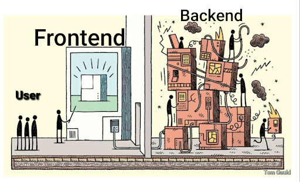
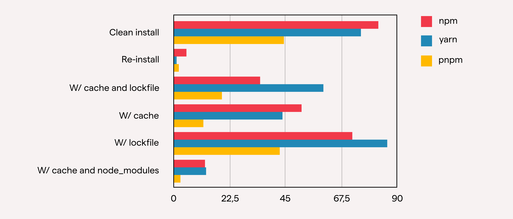
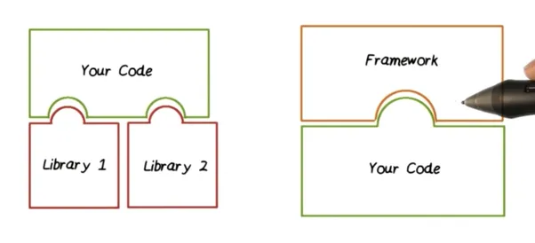

# Pengantar Frontend **Developer**

-   [Pengantar Frontend **Developer**](#pengantar-frontend-developer)
    -   [Kenapa harus memilih frontend?](#kenapa-harus-memilih-frontend)
    -   [Apa aja sih peluang karir di frontend ?](#apa-aja-sih-peluang-karir-di-frontend-)
        -   [Melihat karir alumni dan mahasiswa ITS di bidang Frontend](#melihat-karir-alumni-dan-mahasiswa-its-di-bidang-frontend)
        -   [Apa aja sih yang harus dikuasai oleh seorang frontend **developer**?](#apa-aja-sih-yang-harus-dikuasai-oleh-seorang-frontend-developer)
        -   [Apakah akan terus belajar Frontend ?](#apakah-akan-terus-belajar-frontend-)
    -   [Paradigma Frontend Developer](#paradigma-frontend-developer)
        -   [Procedural Programing](#procedural-programing)
            -   [Karakteristik Utama PP](#karakteristik-utama-pp)
            -   [Contoh Kode Program Procedural](#contoh-kode-program-procedural)
        -   [Object Oriented Programing](#object-oriented-programing)
            -   [Karakteristik Utama OOP](#karakteristik-utama-oop)
        -   [Functional Programing](#functional-programing)
            -   [Karakteristik Utama FP](#karakteristik-utama-fp)
            -   [Contoh Kode Program Functional](#contoh-kode-program-functional)
        -   [Perbandingan Procedural Programing Vs Object Oriented Programing Vs Functional Programing](#perbandingan-procedural-programing-vs-object-oriented-programing-vs-functional-programing)
    -   [Mengenal Frontend lebih dekat](#mengenal-frontend-lebih-dekat)
        -   [Fungsi dalam Frontend: Async, Sync, Callback, dan Lainnya](#fungsi-dalam-frontend-async-sync-callback-dan-lainnya)
            -   [Fungsi Sinkron (Synchronous Function)](#fungsi-sinkron-synchronous-function)
            -   [Fungsi Asinkron (Asynchronous Function)](#fungsi-asinkron-asynchronous-function)
            -   [Fungsi Callback (Callback Function)](#fungsi-callback-callback-function)
            -   [Promise Function](#promise-function)
            -   [Generator Function](#generator-function)
            -   [Arrow Function](#arrow-function)
    -   [Data Object Manipulation (DOM)](#data-object-manipulation-dom)
        -   [Bagaiamanakah cara kerja DOM?](#bagaiamanakah-cara-kerja-dom)
        -   [Cara Mengakses Elemen DOM](#cara-mengakses-elemen-dom)
        -   [Praktik Latihan DOM](#praktik-latihan-dom)
        -   [Summary](#summary)
    -   [AJAX dan Fetch API](#ajax-dan-fetch-api)
        -   [Praktik Latihan AJAX dan Fetch API](#praktik-latihan-ajax-dan-fetch-api)
    -   [Framework Frontend](#framework-frontend)
        -   [History of Frontend Framework](#history-of-frontend-framework)
        -   [Package Manager](#package-manager)
        -   [Library vs Framework](#library-vs-framework)
        -   [Praktik Latihan Library Frontend](#praktik-latihan-library-frontend)
    -   [Tugas](#tugas)
        -   [Deskripsi](#deskripsi)
        -   [Pengumpulan](#pengumpulan)
        -   [Perlu Bantuan?](#perlu-bantuan)
    -   [Penutup](#penutup)
    -   [Referensi](#referensi)

## Kenapa harus memilih frontend?


Mengapa kita harus memilih _Frontend Development_ sebagai batu loncatan karir kita? Pertama-tama, Frontend adalah jendela pertama yang terbuka bagi pengguna saat berinteraksi dengan suatu platform digital. Tampilan yang menarik, responsif, dan mudah dinavigasi merupakan kunci kesuksesan sebuah aplikasi atau website. Dengan menjadi seorang **Frontend Developer**, kita memiliki kekuatan untuk membawa ide-ide dan konsep-konsep menjadi kenyataan yang dapat dirasakan oleh jutaan pengguna di seluruh dunia.

Namun, tak hanya sekadar mempercantik tampilan, menjadi seorang \*Frontend **Developer** juga membuka pintu kepada bonus-bonus menarik yang dapat menghiasi langkah karir Kita. Pertama-tama, Kita akan menjadi arsitek utama dari pengalaman pengguna (User Interface), memahami kebutuhan dan preferensi mereka, sehingga mampu menciptakan antarmuka yang intuitif dan ramah pengguna. Keahlian ini tidak hanya membuat Anda menjadi **developer** yang dicari, tetapi juga membuka peluang untuk terlibat dalam proyek-proyek menarik di berbagai industri. Dan hal ini AI belum bisa menggantikan ya tentunya hehehe…

Kemampuan untuk menguasai teknologi-teknologi terkini dalam dunia Frontend juga memberikan Anda keunggulan kompetitif. Dengan cepatnya perkembangan teknologi, menjadi seorang Frontend **Developer** berarti Anda akan terus berkembang, belajar hal-hal baru, dan tetap relevan di era digital yang selalu berubah. Ini bukan hanya sekadar karir, tetapi juga perjalanan panjang dalam eksplorasi kreativitas dan inovasi.

## Apa aja sih peluang karir di frontend ?

Banyak gak sih dari kita yang sering bertanya-tanya apa sih kelanjutan karir dari seorang frontend **developer**?

Jadi dilansir dari website [NetGuru](https://www.netguru.com/career/paths/frontend) terdapat 4 tahapan karir dalam frontend **developer** yaitu:

-   Junior Frontend **Developer**
-   Frontend **Developer**
-   Senior Frontend **Developer**
-   Frontend Software Architect

Lalu bagaimana sih dengan lulusan para Frontend **developer** di Informatika ITS ini apakah mereka bisa hidup dengan nyaman dengan di frontend ini ?

### Melihat karir alumni dan mahasiswa ITS di bidang Frontend

Siapa aja sih yang sudah sukses di bidang frontend ini? Berikut adalah beberapa alumni dan mahasiswa Informatika ITS yang sudah sukses di bidang frontend:


-   Rizqi Tsani
-   lathifa Itqon
-   Muhammad Yunnus
-   Muhammad Dzikri Syairozi
-   Benedictus Wicaksono
-   Frederick Hidayat
-   Gabriella Natasya Br. Ginting
-   Robby Ulung Pambudi

Dan banyak lagi lainya, jadi jangan ragu untuk memilih frontend sebagai karir kalian nanti.

### Apa aja sih yang harus dikuasai oleh seorang frontend **developer**?

Seorang frontend **developer** harus menguasai beberapa hal berikut ini:

-   HTML
-   CSS
-   JavaScript
-   Framework (React, Angular, Vue, dll)
-   Version Control (Git)

Yang tentunya teman-teman sudah belajar di matakuliah Pemrograman Web.

### Apakah akan terus belajar Frontend ?

Mungkin hal tersebut yang telah membayangi kami dan teman - teman semua, tetapi ketika kalian sudah mengenal yang namanya Konsep “T Shaped **Developer**”


T-Shaped **Developer** mengacu pada konsep seorang pengembang yang memiliki keahlian utama yang luas (T horizontal) dan keahlian mendalam pada satu area khusus (garis vertikal pada huruf T).

Secara mudah dipahami, bayangkan T sebagai representasi kemampuan seorang pengembang. Garis horizontal melambangkan pemahaman dasar atau pengetahuan luas di berbagai aspek pengembangan, seperti Frontend, Backend, database, dan pengelolaan proyek. Sementara itu, garis vertikal menunjukkan keahlian mendalam atau spesialisasi di satu area tertentu, seperti pengembangan Frontend dengan keahlian khusus dalam framework tertentu.

Apakah hanya ada konsep itu mas admin?


Tentu tidak karena disini Ada I, T, N dan M. tetapi untuk kalangan baru memulai maka kita bisa tetapkan target kita di T terlebih dahulu. setelah bisa menguasai hal tersebut bisa terus lanjut ke N dan seterusnya sampai menjadi A. Apa itu A? A adalah Avatar.


## Paradigma Frontend Developer

Sesuai yang dijelaskan diatas bahwasanya frontend adalah sebuah “jendela pertama yang terbuka bagi pengguna saat berinteraksi dengan suatu platform digital.” Maka dalam sub bab kali ini kita akan membahas bagaimana cara mengorganisir kode secara baik dengan mengenal 3 konsep utama kita yaitu: “Prosedural Pemrograman”, “Object Oriented Programing”, “Functional Programing”

### Procedural Programing


Procedural Programing dapat didefinisikan sebagai rutinitas, subrutin, atau sebuah fungsi yang secara sederhana terdiri dari serangkaian langkah komputasi yang harus dilakukan. Setiap fungsi mewakili tugas atau tindakan spesifik yang perlu dilakukan oleh program. Fokus utama pemrograman prosedural adalah memecah logika program menjadi komponen-komponen yang dapat dikelola, dapat digunakan kembali, dan modular.

#### Karakteristik Utama PP

Karakteristik utama dari pemrograman prosedural meliputi:

1. Modularity

    Kode program dipecah menjadi fungsi atau prosedur yang lebih kecil dan masing masing bertanggung jawab untuk tugas tertentu

2. Function Call

    Prosedur atau fungsi dapat dipanggil secara berurutan. Dan sering kali fungsi mengambil sebuah parameter input dan dikembalikan sebagai hasil output

3. Global Variable

    Program prosedural sering menggunakan variabel global untuk menyimpan data yang dapat diakses oleh beberapa fungsi. Namun, penggunaan variabel global yang berlebihan dapat menyebabkan masalah seperti efek samping yang tidak diinginkan dan kesulitan dalam memahami aliran data.

4. Sequential Execution

    program dieksekusi dalam urutan linier. Pernyataan dieksekusi satu demi satu, dan struktur kontrol seperti loop dan kondisional menentukan aliran eksekusi.

5. Limited Reusability

    Penggunaan Ulang Terbatas: Meskipun fungsi meningkatkan penggunaan ulang dibandingkan dengan kode monolitik, fungsi biasanya terbatas untuk digunakan dalam program yang sama. Fungsi tidak dienkapsulasi dan dapat digunakan kembali seperti kelas dan objek dalam pemrograman berorientasi objek.

#### Contoh Kode Program Procedural

```javascript
function calculateArea(length, width) {
    return length * width;
}

function calculateVolume(length, width, height) {
    return length * width * height;
}

let area = calculateArea(10, 20);
let volume = calculateVolume(10, 20, 30);
```

Dari contoh kode diatas kita dapat melihat bahwa kode tersebut terdiri dari beberapa fungsi yang masing masing bertanggung jawab untuk tugas tertentu. Fungsi `calculateArea` bertugas untuk menghitung luas, sedangkan fungsi `calculateVolume` bertugas untuk menghitung volume. Kedua fungsi tersebut dapat dipanggil secara berurutan dan masing masing fungsi mengambil parameter input dan mengembalikan hasil output.

### Object Oriented Programing


Object-Oriented Programming (OOP) adalah paradigma pemrograman yang berfokus pada konsep "objek". Konsep ini memungkinkan programmer untuk mengorganisir dan mendesain kode mereka dengan cara yang mencerminkan atau merepresentasikan objek dalam dunia nyata. Mari kita bahas beberapa konsep dasar OOP dengan cara yang mudah dipahami:

#### Karakteristik Utama OOP

1. **Object**

    - Objek adalah entitas yang memiliki atribut (data) dan metode (fungsi) yang dapat dijalankan.
    - Contoh: Jika kita berbicara tentang mobil, objeknya bisa menjadi "Mobil BMW X3" dengan atribut seperti warna, kecepatan, dan metode seperti "hidupkan mesin".

2. **Class**

    - Kelas adalah cetak biru atau blueprint untuk membuat objek.
    - Contoh: Jika "Mobil BMW X3" adalah objek, maka "Mobil" adalah kelas yang mendefinisikan bagaimana objek mobil harus dibuat dan memiliki atribut/metode apa.

3. **Atribut**

    - Atribut adalah karakteristik atau data yang dimiliki oleh objek.
    - Contoh: Dalam kelas "Mobil", atributnya bisa menjadi "warna", "kecepatan", dan lainnya.

4. **Metode**

    - Metode adalah fungsi atau tindakan yang dapat dilakukan oleh objek.
    - Contoh: Dalam kelas "Mobil", metodenya bisa menjadi "hidupkanMesin()", "matikanMesin()", atau "percepat()".

5. **Inheritance (Pewarisan)**

    - Pewarisan memungkinkan kelas baru ("subclass" atau "child class") untuk mewarisi atribut dan metode dari kelas yang sudah ada ("superclass" atau "parent class").
    - Contoh: Jika ada kelas "Truk" dan kelas "Mobil" sebagai superclass, maka "Truk" dapat mewarisi atribut dan metode dari "Mobil".

6. **Polimorfisme**

    - Polimorfisme memungkinkan objek dari kelas yang berbeda untuk merespons metode dengan cara yang sama.
    - Contoh: Metode "bersuara()" dapat digunakan baik oleh objek "Anjing" maupun "Kucing", dan keduanya mengeluarkan suara yang berbeda.

7. **Enkapsulasi**
    - Enkapsulasi melibatkan penyembunyian detail implementasi dari dunia luar dan membatasi akses langsung ke beberapa bagian dari objek.
    - Contoh: Dengan menggunakan enkapsulasi, kita dapat membatasi akses langsung ke atribut seperti "saldoBank" dalam objek "RekeningBank".

Tentunya hal-hal diatas sudah tidak asing lagi bagi kalian karena sudah pernah dipelajari di kelas `Pemrograman Berbasis Kerangka Kerja`.

OOP sendiri masih dipakai di library yang sangat terkenal bagi kita yaitu “React JS” namun penggunaan Object Oriented sendiri sudah tidak direkomendasikan oleh tim dari React JS dan lebih menyarankan menggunakan Functional Programing.

### Functional Programing

**Pemrograman fungsional** (FP) merupakan paradigma pemrograman deklaratif yang berfokus pada pendefinisian dan komposisi fungsi untuk menyelesaikan masalah komputasi. Alih-alih berfokus pada mutasi state program, FP menekankan pada evaluasi ekspresi dan transformasi data melalui fungsi-fungsi murni.

#### Karakteristik Utama FP

1. **Fungsi sebagai Warga Kelas Satu**:

    - Fungsi bukan hanya subrutin, tetapi entitas yang dapat dimanipulasi seperti data.
    - Fungsi dapat diteruskan sebagai argumen, dikembalikan sebagai nilai, dan diikat ke variabel.

2. **Imutabilitas**

    - Data dalam program fungsional tidak dapat diubah setelah diinisialisasi.
    - Hal ini meningkatkan prediktabilitas dan memudahkan debugging.

3. **Rekursi**

    - Fungsi dapat memanggil diri sendiri untuk memecah masalah kompleks menjadi sub-masalah yang lebih kecil.
    - Rekursi memungkinkan solusi elegan untuk masalah seperti perhitungan faktorial dan traversal struktur data.

4. **Komposisi Fungsi**
    - Fungsi-fungsi kecil dapat digabungkan untuk membentuk fungsi yang lebih kompleks.
    - Komposisi fungsi meningkatkan modularitas dan keterbacaan kode.

#### Contoh Kode Program Functional

```typescript
// Fungsi murni untuk menghitung total penjualan
const totalPenjualan = (
    produkList: { harga: number; jumlah: number }[]
): number => {
    return produkList.reduce(
        (total, produk) => total + produk.harga * produk.jumlah,
        0
    );
};

// Contoh penggunaan
const produkList = [
    { harga: 10, jumlah: 2 },
    { harga: 5, jumlah: 3 },
];

const total = totalPenjualan(produkList);
console.log(`Total penjualan: ${total}`); // Output: Total penjualan: 35
```

### Perbandingan Procedural Programing Vs Object Oriented Programing Vs Functional Programing

|      Fitur       |          Procedural Programming          |       Object-Oriented Programming        |               Functional Programming               |     |
| :--------------: | :--------------------------------------: | :--------------------------------------: | :------------------------------------------------: | --- |
| Paradigma Utama  |          Urutan langkah-langkah          |          Objek dan interaksinya          |            Fungsi dan transformasi data            |     |
|     Struktur     |           Prosedur dan fungsi            |             Kelas dan Objek              |                    Fungsi murni                    |     |
|      State       |                 Mutable                  |           Mutable dalam objek            |                     Immutable                      |     |
|   Fokus Utama    | Memecahkan masalah dengan urutan langkah |   Mendefinisikan entitas dan perilaku    |           Transformasi data tanpa mutasi           |     |
|   Konsep Utama   |     Fungsi, variabel, struktur data      | Kelas, objek, inheritance, encapsulation | Fungsi murni, immutability, higher-order functions |     |
|    Keuntungan    |      Mudah dipahami dan dipelajari       |     Modularitas dan reusability kode     |         Kode mudah diuji dan diverifikasi          |     |
|    Kekurangan    |       Kurang modular dan reusable        |     Kompleksitas untuk proyek besar      |       Kurang familiar bagi banyak programmer       |     |
|  Contoh Bahasa   |            C, Fortran, BASIC             |         Java, C++, Python (OOP)          |            Haskell, Erlang, Elm, Scala             |     |
| Aplikasi Terbaik |        Proyek kecil dan sederhana        |   Sistem kompleks, aplikasi enterprise   |        Sistem real-time, pemrosesan paralel        |     |

Dari tabel diatas kita dapat melihat perbandingan antara Procedural Programing, Object Oriented Programing, dan Functional Programing. Masing masing paradigma memiliki kelebihan dan kekurangan tersendiri. Pemilihan paradigma yang tepat tergantung pada kebutuhan dan karakteristik proyek yang sedang dikerjakan.

---

## Mengenal Frontend lebih dekat

Setelah kita mengetahui dasar - dasar dari pengembangan web, maka pada kesempatan kali ini kita akan mempelajari lebih lanjut mengenai Frontend secara teknis yang mencakup pengenalan fungsi dan pengenalan DOM secara matang sebelum lanjut ke dalam Framework.

### Fungsi dalam Frontend: Async, Sync, Callback, dan Lainnya


Fungsi adalah alat penting dalam pengembangan perangkat lunak. Mereka membantu membuat kode lebih terstruktur, modular, reusable, dan mudah diuji. Memahami cara kerja dan jenis-jenis fungsi sangat penting bagi programmer untuk menulis kode yang berkualitas dan efisien.

#### Fungsi Sinkron (Synchronous Function)

Synchronous Function merupakan sebuah fungsi yang setiap prosesnya diselesaikan terlebih dahulu sebelum lanjut ke dalam fungsi berikutnya.

Bayangkan kita sedang memasak makanan. Setiap langkah dalam resep harus diselesaikan secara berurutan. kita tidak bisa memulai langkah berikutnya sampai langkah sebelumnya selesai.

Dalam Frontend Developer Fungsi sinkron ideal untuk tugas-tugas sederhana yang tidak memerlukan waktu lama untuk dijalankan, seperti:

-   Manipulasi data lokal
-   Perhitungan sederhana
-   Pengambilan keputusan berdasarkan data yang sudah tersedia

```typescript
function addNumbers(a, b) {
    // Penjumlahan dua angka
    return a + b;
}
const result = addNumbers(5, 3);
console.log(result); // Output: 8
```

Dalam contoh ini, fungsi addNumbers dijalankan secara sinkron. Kode di dalam fungsi dijalankan baris demi baris. Pertama, nilai a dan b ditambahkan. Kemudian, hasilnya dikembalikan dan disimpan dalam variabel result. Terakhir, nilai result dicetak ke konsol.

#### Fungsi Asinkron (Asynchronous Function)


Sebagai kelanjutan dari pembahasan fungsi sinkron, mari kita dalami fungsi asinkron dalam frontend.

Sekarang bayangkan kita sedang memasak sebuah pizza. Kita dapat memasukkan pizza ke oven (operasi asinkron yang memerlukan waktu) dan sambil menunggu, kita dapat mencuci piring (melakukan tugas lain tanpa terpaku pada pizza).

Dalam Programer Fungsi asinkron adalah blok kode yang tidak dijalankan secara berurutan melainkan melakukan operasi secara non-blocking. Artinya, program utama tidak menunggu fungsi asinkron selesai sebelum melanjutkan ke baris kode berikutnya.

Fungsi asinkron dapat dieksekusi di latar belakang sambil program utama menjalankan bagian lain seperti dengan analogi diatas.

Penggunaan asinkron function dapat meningkatkan performa dari aplikasi yang akan kita buat. Fungsi ini sangatlah penting dalam pengembangan.

Penggunaan asinkron function dapat meningkatkan performa dari aplikasi yang akan kita buat. Fungsi ini sangatlah penting dalam pengembangan Frontend Developer yang merupakan pasukan terdepan dikarenakan tugas kita adalah menyajikan tampilan secara tepat walaupun di belakang layar proses tersebut berjalan tidak semestinya.



Setelah kita mengerti dan memahami konsep dari Asinkron function selanjutnya adalah mulai mengenal dengan mempraktekkan secara langsung. Mari kita mulai dengan menggunakan case study yang sederhana.

Budi ingin membuat sebuah program yang menampilkan daftar nama 5 orang secara berurutan dengan delay 1 detik di antara setiap nama, dan kata hallo pada detik ke 2.

```typescript
const names = ["Andi", "Budi", "Cici", "Doni", "Eko"];
function displayNames() {
    for (let i = 0; i < names.length; i++) {
        setTimeout(() => {
            console.log(names[i]);
        }, i * 1000);
    }
    setTimeout(() => {
        console.log("hallo");
    }, 2000);
}

displayNames();
```

#### Fungsi Callback (Callback Function)

Bayangkan Anda meminta teman untuk membelikan sesuatu di toko. Anda tidak hanya memberi mereka uang, tetapi juga instruksi tentang apa yang harus dibeli. Instruksi ini bisa dianggap sebagai fungsi callback.

Fungsi callback adalah fungsi yang dipassed sebagai argumen ke fungsi lain dan dieksekusi ketika kondisi tertentu terpenuhi atau operasi selesai. Ini seperti memberikan instruksi tambahan yang akan dijalankan nanti oleh fungsi lain.

```typescript
function fetchData(url, callback) {
    // Lakukan fetch data dari URL
    // ...

    // Ketika data selesai diambil, panggil callback dengan data tersebut
    callback(data);
}

fetchData("https://api.example.com/data", (data) => {
    console.log(data); // Data tersedia setelah fetching selesai
});
```

**Kapan menggunakan fungsi callback?**

-   `Operasi asinkron`: Ketika Anda perlu menunggu hasil dari operasi asinkron (misalnya, fetching data dari API), Anda dapat menggunakan callback untuk menangani hasil tersebut setelah tersedia.

-   `Event handling`: Callback sering digunakan dalam event handling untuk menjalankan kode tertentu ketika event terjadi (misalnya, klik tombol).

#### Promise Function

Promise adalah sebuah objek dalam JavaScript yang merepresentasikan hasil asynchronous operation (sukses atau gagal) di masa depan. Ia menyediakan API terstruktur untuk menangani dan chaining operasi asynchronous, meningkatkan reliability dan maintainability kode.

Mari kita analogikan Promise function dengan kegiatan kita sehari - hari. Sekarang bayangkan kita sedang memesan pizza secara online. Anda tidak tahu persis kapan pizza akan tiba (operasi asynchronous). Namun, toko pizza dapat memberikan sebuah "promise" (janji) bahwa pizza akan sampai dalam waktu tertentu.

Promise ini memungkinkan Anda melanjutkan aktivitas lain sambil menunggu pizza tiba, dan Anda akan diberitahu ketika pizza sudah siap (sukses) atau terjadi masalah (gagal).

Seperti itulah analogi dari penjelasan promise function dalam kegiatan kita sehari - hari, selanjutnya seperti apa sih cara implementasi Promise Function dalam Frontend Developer:

```typescript
function fetchData(url) {
    return new Promise((resolve, reject) => {
        // Lakukan fetch data dari URL

        if (sukses) {
            resolve(data); // resolve dengan data jika sukses
        } else {
            reject(error); // reject dengan error jika gagal
        }
    });
}

fetchData("https://api.example.com/data")
    .then((data) => {
        console.log("Data diterima:", data);
    })
    .catch((error) => {
        console.error("Error:", error);
    });
```

Lalu apa bedanya dengan `.then()` dan `.catch()` kan bisa aja tuh ditaruh didalam situ tanpa harus menggunakan Promise? kalau kita lihat penjelasan diatas kita bisa tarik sebuah perbedaan bahwa promise itu hanya sebatas Janji sedangkan then dan `catch` adalah apa yang akan dilakukan ketika mendapat sebuah kegagalan atau kesuksesan dalam pemanggilan.

Kalau teman-teman masih susah untuk memahami perbedaan tersebut mari kita per muda dengan masalah ini. Anggap `pizza` yang kita pesan tadi sudah sampai. Tetapi pesanan tersebut berbeda dengan apa yang kita pesan (`Promise`). Disini kita bisa menolak (`Rejected`) pesanan tersebut dan meminta pesanan baru sesuai apa yang kita inginkan (`Catch`). Apabila kita tidak menggunakan Promise maka pesanan tersebut akan diterima sebagai Berhasil (`Then`).

Seperti itulah konsep penggunaan dari `Promise`.

#### Generator Function

Generator function adalah fungsi khusus yang menghasilkan iterator. Ia memungkinkan Anda menghentikan dan melanjutkan eksekusi kode, dan menghasilkan serangkaian nilai secara bertahap.

Generator function sangat berguna dalam menghasilkan nilai secara bertahap, seperti mengambil data dari API secara bertahap, menghasilkan angka secara bertahap, dan lainnya.

```typescript
function* generateNumbers() {
    yield 1;
    yield 2;
    yield 3;
}

const numbers = generateNumbers();
console.log(numbers.next().value); // Output: 1
console.log(numbers.next().value); // Output: 2
console.log(numbers.next().value); // Output: 3
```

#### Arrow Function

Fungsi singkat dan ringkas untuk menulis ekspresi pendek.

```typescript
const addNumbers = (a, b) => a + b;
console.log(addNumbers(5, 3)); // Output: 8
```

---

## Data Object Manipulation (DOM)


Pasti teman-teman sudah tidak asing dengan materi pembahasan kali ini yaitu DOM. Document Object Model (DOM) adalah antarmuka pemrograman yang merepresentasikan struktur dan konten halaman web sebagai pohon objek. Setiap elemen dalam kode HTML, seperti paragraf, judul, gambar, dan formulir, sesuai dengan node di pohon ini.

Dengan memanipulasi DOM, Anda dapat secara dinamis mengubah tampilan dan perilaku halaman web. Ini termasuk tugas-tugas seperti:

-   **Menambahkan atau menghapus elemen**: Anda dapat membuat elemen HTML baru dan menambahkannya ke DOM, atau menghapus elemen yang ada sepenuhnya.
-   **Mengubah konten**: Anda dapat mengubah konten teks elemen, memperbarui atribut, dan menyesuaikan gaya.
-   **Menanggapi peristiwa**: Anda dapat melampirkan pendengar peristiwa ke elemen, sehingga kode Anda dapat bereaksi terhadap interaksi pengguna seperti klik, penekanan tombol, atau pengiriman formulir.
-   **Membangun antarmuka interaktif**: Dengan memanipulasi DOM, Anda dapat membuat aplikasi web yang dinamis dan interaktif.

### Bagaiamanakah cara kerja DOM?

DOM adalah representasi struktur halaman web yang dihasilkan oleh browser. Ketika browser memuat halaman web, ia membaca kode HTML dan mengonversinya menjadi pohon objek yang dapat diakses oleh JavaScript.

Setiap elemen HTML, atribut, dan teks dianggap sebagai node dalam pohon. Anda dapat menggunakan JavaScript untuk mengakses, menavigasi, dan memanipulasi node ini sesuai kebutuhan.

Contoh sederhana dari DOM adalah sebagai berikut:

```html
<!DOCTYPE html>
<html>
    <head>
        <title>Contoh DOM</title>
    </head>
    <body>
        <h1>Hello, World!</h1>
        <p>Selamat datang di contoh DOM.</p>
    </body>
</html>
```

Dalam contoh ini, elemen `<html>` adalah node root dari pohon DOM. Setiap elemen lain, seperti `<head>`, `<title>`, `<body>`, `<h1>`, dan `<p>`, adalah node yang ditambahkan ke pohon.

### Cara Mengakses Elemen DOM

Anda dapat mengakses elemen DOM menggunakan JavaScript dengan beberapa cara:

1. **getElementById()**: Mengambil elemen dengan ID tertentu.
2. **getElementsByClassName()**: Mengambil elemen dengan kelas tertentu.
3. **getElementsByTagName()**: Mengambil elemen dengan tag tertentu.
4. **querySelector()**: Mengambil elemen dengan selector CSS.
5. **querySelectorAll()**: Mengambil semua elemen yang cocok dengan selector CSS.

Dokumentasi lengkap tentang cara mengakses elemen DOM dapat ditemukan di [MDN Web Docs](https://developer.mozilla.org/en-US/docs/Web/API/Document_Object_Model/Introduction).

### Praktik Latihan DOM

Untuk memperdalam pemahaman tentang DOM, Kita telah menyiapkan sebuah study case sederhana yaitu membuat sebuah note app sederhana. Dalam study case ini, Kita akan menggunakan HTML, CSS, dan JavaScript untuk membuat aplikasi web yang memungkinkan pengguna menambahkan, menghapus, dan menyimpan catatan.

Tentunya untuk aplikasi kali ini kita buat menggunakan konsep DOM yang telah kita pelajari sebelumnya.

### Summary

Dari praktik latihan dan pembahasan materi diatas kita bisa tahu bahwa DOM berperan untuk melakukan update secara terus menerus pada halaman web kita. Dengan menggunakan DOM kita bisa membuat aplikasi yang dinamis dan interaktif.

---

## AJAX dan Fetch API

AJAX (Asynchronous JavaScript and XML) adalah teknik pengiriman dan pengambilan data dari server tanpa memuat ulang halaman web. Ini memungkinkan aplikasi web untuk memperbarui konten secara dinamis tanpa mengganggu pengalaman pengguna.

Sebagai contoh, ketika Anda mengirim formulir, Anda tidak perlu memuat ulang halaman untuk menampilkan pesan sukses atau kesalahan. Sebaliknya, Anda dapat menggunakan AJAX untuk mengirim permintaan ke server, menerima respons, dan memperbarui halaman sesuai dengan respons tersebut.

Fetch API adalah API baru yang diperkenalkan dalam JavaScript modern untuk mengambil dan mengirim data melalui jaringan. Ia menyediakan antarmuka yang jelas dan mudah digunakan untuk mengambil sumber daya dari jaringan.

Contoh penggunaan Fetch API:

```javascript
fetch("https://api.example.com/data")
    .then((response) => response.json())
    .then((data) => console.log(data))
    .catch((error) => console.error(error));
```

Dalam contoh ini, kita menggunakan fetch() untuk mengambil data dari URL tertentu. Kemudian, kita menggunakan .then() untuk menangani respons yang diterima, dan .catch() untuk menangani kesalahan yang terjadi.

Contoh penggunaan AJAX:

```javascript
const xhr = new XMLHttpRequest();
xhr.open("GET", "https://api.example.com/data", true);
xhr.onreadystatechange = function () {
    if (xhr.readyState === 4 && xhr.status === 200) {
        console.log(JSON.parse(xhr.responseText));
    }
};
xhr.send();
```

Dalam contoh ini, kita menggunakan XMLHttpRequest untuk mengirim permintaan GET ke URL tertentu. Kemudian, kita menggunakan onreadystatechange untuk menangani respons yang diterima.

### Praktik Latihan AJAX dan Fetch API

Meneruskan dari materi sebelumnya, kita akan menggunakan AJAX dan Fetch API untuk memperbarui aplikasi note app yang telah kita buat sebelumnya. Dalam study case ini, kita akan menggunakan AJAX atau Fetch API untuk menyimpan catatan ke server dan memuat catatan dari server.

Dalam hal ini untuk API sudah kita sediakan dan kita hanya perlu menggunakannya saja.

---

## Framework Frontend

Setelah kita mempelajari dasar-dasar dari pengembangan web, maka pada kesempatan kali ini kita akan mempelajari lebih lanjut mengenai Framework Frontend yang sangat populer di kalangan Frontend Developer.

### History of Frontend Framework

Perkemabangan ini dimulai karena adanya kebutuhan untuk membuat standar dalam pengembangan web. Sebelumnya, pengembangan web dilakukan dengan cara yang tidak terstruktur, tidak terorganisir, dan tidak terstandarisasi. Hal ini menyebabkan kode yang sulit dipelihara, tidak mudah diuji, dan tidak mudah diubah.

Dimulai dari tahun 2000-an, mulai munculnya stndarisasi css dan javascript. Pada tahun 2006, jQuery muncul sebagai library javascript yang sangat populer. jQuery memudahkan pengembangan web dengan menyediakan API yang mudah digunakan untuk memanipulasi DOM, menangani event, dan melakukan AJAX.

Meskipun jQuery sangat populer, namun pengembangan web masih memiliki banyak masalah. Kode yang besar, sulit dipelihara, dan tidak mudah diuji. Hal ini menyebabkan munculnya framework frontend modern seperti Angular, Vue, dan Next JS

Setiap framework memiliki kelebihan dan kekurangan tersendiri. Angular adalah framework yang sangat kuat dan lengkap, namun memiliki kurva belajar yang tinggi. Next JS adalah framework yang sangat populer untuk pengembangan web dengan React. Vue adalah framework yang sangat mudah dipelajari dan digunakan, namun kurang populer dibandingkan Angular dan React.

### Package Manager

Sebelum kita masuk ke dalam Framework Frontend, kita akan mempelajari terlebih dahulu tentang Package Manager. Package Manager adalah alat yang digunakan untuk mengelola dependensi dan paket dalam proyek perangkat lunak. Ia memungkinkan Anda untuk menginstal, menghapus, dan mengelola paket-paket yang diperlukan dalam proyek Anda.

Ada banyak package manager yang tersedia, namun yang paling populer adalah npm (Node Package Manager) dan Yarn. npm adalah package manager bawaan untuk Node.js, sedangkan Yarn adalah package manager yang dikembangkan oleh Facebook.



PNPM adalah package manager yang dikembangkan oleh Zoltan Kochan. Ia menawarkan kecepatan yang lebih tinggi daripada npm dan Yarn, serta penggunaan ruang disk yang lebih efisien.

### Library vs Framework



Terkadang, kita sering mendengar istilah library dan framework. Apa sih perbedaan antara library dan framework?

**Library** adalah kumpulan kode yang dapat digunakan kembali untuk menyelesaikan masalah tertentu. Library tidak mengatur alur kerja aplikasi, melainkan menyediakan fungsi-fungsi yang dapat digunakan oleh aplikasi. Kita dapat menggunakan library sesuai kebutuhan, dan tidak terikat dengan struktur tertentu.

Contoh library: jQuery, Lodash, Moment.js, React JS.

**Framework** adalah kerangka kerja yang menyediakan struktur dan alur kerja untuk aplikasi. Framework terdiri dari kumpulan library, aturan, dan konvensi yang harus diikuti oleh aplikasi. Framework mengatur alur kerja aplikasi, dan aplikasi harus mengikuti struktur yang ditentukan oleh framework.

Contoh framework: Angular, Vue, Next JS

### Praktik Latihan Library Frontend

Sebelumnya kita telah membuat sebuah aplikasi note app sederhana menggunakan HTML, CSS, dan JavaScript. Sekarang, kita akan memperbarui aplikasi tersebut dengan menggunakan library frontend.

Dalam study case ini, kita akan menggunakan React JS untuk memperbarui aplikasi note app yang telah kita buat sebelumnya. Dengan menggunakan React JS, kita dapat membuat aplikasi web yang dinamis dan interaktif dengan mudah.

Kenapa tidak langsung menggunakan framework? Karena dengan menggunakan library kita bisa lebih memahami konsep dasar dari pengembangan web. Setelah kita memahami konsep dasar, kita dapat mempelajari framework dengan lebih mudah.

Selamat Menonton :)

---

### Perlu Bantuan?

Teman - teman bisa bertanya di grup atau langsung ke asisten terkait. Jangan sungkan untuk bertanya karena kita disini saling belajar.

Atau bisa juga langsung ke [Github Discussion](https://github.com/Lab-RPL-ITS/Modul-Oprec-FE-2025/discussions) untuk bertanya - tanya.

## Penutup

Sekian dari kita, semoga materi ini bermanfaat bagi teman - teman semua. Jangan lupa untuk selalu berlatih dan jangan pernah menyerah. Kita disini saling belajar dan saling bantu. Sampai jumpa di pertemuan selanjutnya. Terima kasih.

---

## Referensi

-   <https://www.encora.com/insights/class-components-vs-functional-components-in-react>
-   <https://react.dev/reference/react/Component>
-   <https://www.wired.com/2015/09/whatsapp-serves-900-million-users-50-engineers/>
-   <https://www.mendix.com/blog/asynchronous-vs-synchronous-programming/>
-   "Eloquent JavaScript" by Marijn Haverbeke
-   [Refactoring Guru](https://refactoring.guru/design-patterns)
-   Clean Code by Robert C. Martin
-   Refactoring Improving the Design of Existing Code
